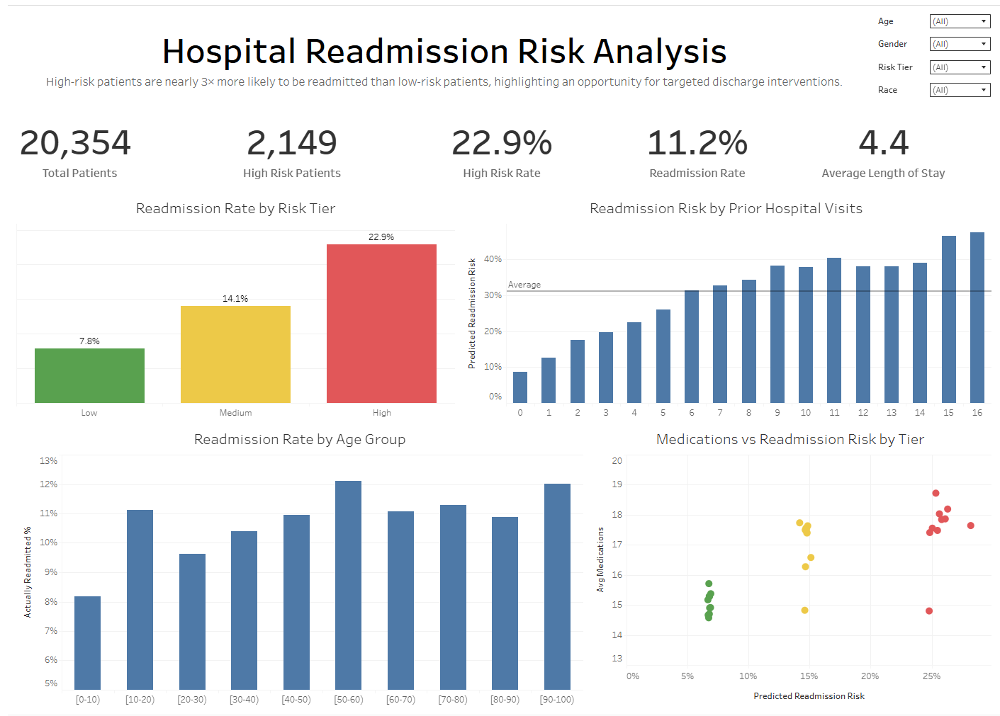

# Hospital Readmission Risk Analysis
Predicting 30-day hospital readmissions using patient encounter data from 130 US hospitals.

## 📊 Interactive Dashboard
**[View Live Tableau Dashboard →](https://public.tableau.com/views/HospitalReadmissionRiskAnalysis_17745410531980/Dashboard1)**


Explore readmission risk by risk tier, age group, prior hospital visits, and medication complexity. Includes interactive filters for age, gender, race, and risk tier.

## Problem
Hospitals face CMS penalties for high 30-day readmission rates. Identifying high-risk patients before discharge enables targeted interventions (follow-up calls, home health visits) to reduce preventable readmissions.

## Data
- **Source:** [UCI Diabetes 130-US Hospitals](https://archive.ics.uci.edu/dataset/296/diabetes+130-us+hospitals+for+years+1999-2008)
- **Size:** 101,766 patient encounters
- **Features:** Demographics, diagnoses, medications, prior utilization, length of stay

## Approach
1. **EDA:** Identified key risk factors (prior inpatient stays, medication count, length of stay)
2. **Feature Engineering:** Created risk indicators (high utilizer flag, long stay flag, etc.)
3. **Modeling:** Random Forest with class balancing to handle 11% positive rate
4. **Risk Tiers:** Segmented patients into Low/Medium/High risk for care prioritization

## Results
| Risk Tier | Patients | Readmission Rate |
|-----------|----------|------------------|
| High | 2,149 | 22.9% |
| Medium | 5,893 | 14.1% |
| Low | 12,312 | 7.8% |

High-risk patients are **3x more likely** to be readmitted than low-risk.

**Model Performance:**
- ROC-AUC: 0.64
- The model successfully triples the capture rate of high-risk patients compared to the baseline population.
- Recall: 51% (catches half of actual readmissions)

## Project Structure
```
├── data/
│   ├── raw/
│   ├── processed/
│   └── output/
├── notebooks/
│   └── exploration.ipynb
├── python/
│   ├── 01_pull_cms_api.py
│   ├── 02_data_cleaning.py
│   ├── 03_feature_engineering.py
│   ├── 04_modeling.py
│   └── 05_export_for_tableau.py
└── README.md
```

## How to Run
1. Install requirements: `pip install -r requirements.txt`
2. Run scripts in order:
   - `python/01_pull_cms_api.py` (optional - demo only)
   - `python/02_data_cleaning.py`
   - `python/03_feature_engineering.py`
   - `python/04_modeling.py`
   - `python/05_export_for_tableau.py`
3. Explore results in `notebooks/exploration.ipynb`

## Key Findings
- **Prior inpatient stays** is the strongest predictor — patients with 2+ prior admissions have significantly higher risk
- **Number of medications** correlates with complexity and readmission risk
- **Discharge disposition** matters — SNF/rehab discharges have higher rates than home discharges

## Tools
Python (pandas, scikit-learn), SQL, Tableau

## Next Steps
- [ ] Test additional models (XGBoost, Logistic Regression)
- [ ] Add SHAP values for individual prediction explanations
