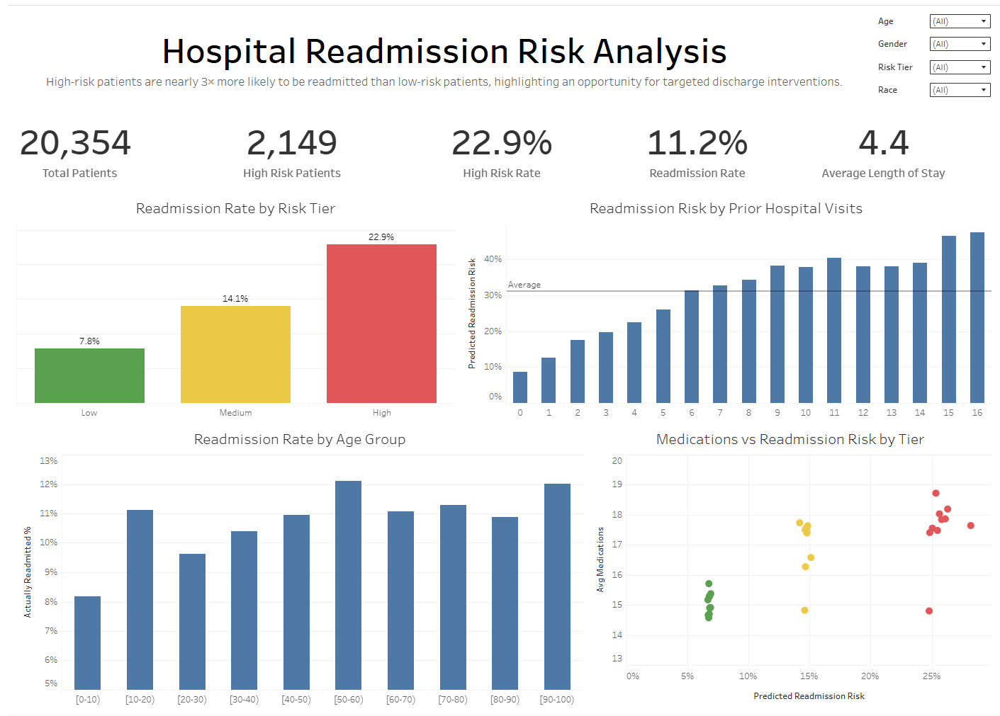

# Hospital Readmission Risk Analysis

Healthcare analytics workflow using patient encounter data from 130 US hospitals to explore 30-day readmission risk.

The project combines SQL, Python, and Tableau-oriented outputs to identify risk factors, build a baseline model, and segment patients into risk tiers for care prioritization.

## Interactive Dashboard

[View Live Tableau Dashboard](https://public.tableau.com/views/HospitalReadmissionRiskAnalysis_17745410531980/Dashboard1)



Explore readmission risk by risk tier, age group, prior hospital visits, and medication complexity. Includes interactive filters for age, gender, race, and risk tier.

## Data

- Source: [UCI Diabetes 130-US Hospitals](https://archive.ics.uci.edu/dataset/296/diabetes+130-us+hospitals+for+years+1999-2008)
- Size: 101,766 patient encounters
- Features: demographics, diagnoses, medications, prior utilization, length of stay, and readmission outcome

## Workflow

1. Cleaned and prepared encounter-level data
2. Explored readmission patterns by utilization, medication count, length of stay, and discharge context
3. Created risk indicators such as prior utilization and long-stay flags
4. Trained a Random Forest baseline with class balancing for the 30-day readmission target
5. Exported patient-level risk tiers for dashboarding and analysis

## Results

| Risk Tier | Patients | Readmission Rate |
| --- | ---: | ---: |
| High | 2,149 | 22.9% |
| Medium | 5,893 | 14.1% |
| Low | 12,312 | 7.8% |

High-risk patients were about 3x more likely to be readmitted than low-risk patients in this analysis.

Model performance was modest:

- ROC-AUC: 0.64
- Recall: 51%

Readmission prediction is difficult with limited structured features, so the main value of this project is the analysis workflow and risk segmentation rather than a production-ready model.

## Key Findings

- Prior inpatient utilization was the strongest readmission signal
- Medication count correlated with patient complexity and readmission risk
- Discharge context mattered, with SNF/rehab discharges showing higher risk than home discharges

## Project Structure

```text
hospital-readmission-analysis/
├── data/
│   ├── raw/
│   ├── processed/
│   └── output/
├── notebooks/
│   └── exploration.ipynb
├── python/
│   ├── 01_pull_cms_api.py
│   ├── 02_data_cleaning.py
│   ├── 03_feature_engineering.py
│   ├── 04_modeling.py
│   └── 05_export_for_tableau.py
├── sql/
├── tableau/
├── requirements.txt
└── README.md
```

## How to Run

```bash
pip install -r requirements.txt
python python/02_data_cleaning.py
python python/03_feature_engineering.py
python python/04_modeling.py
python python/05_export_for_tableau.py
```

`python/01_pull_cms_api.py` is optional and only used as an API integration demo.

## Tools

- Python: pandas, scikit-learn
- SQL
- Tableau

## Notes

This analysis uses a public dataset. The model should not be used for clinical decisions without stronger validation, calibration, and site-specific review.
